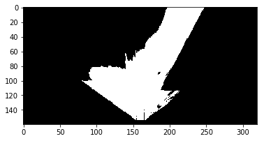
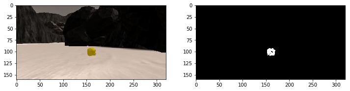
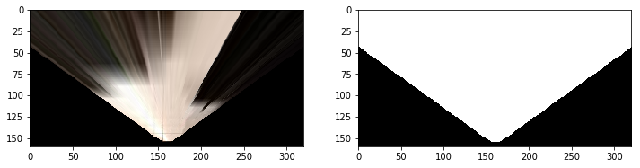
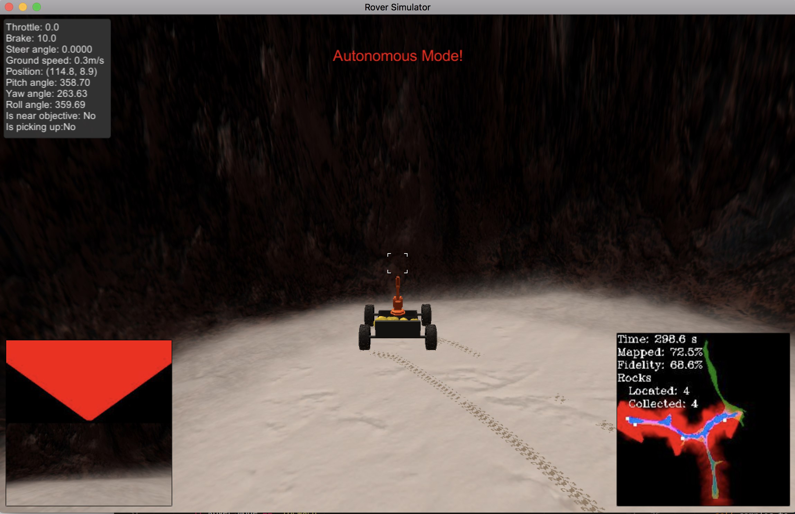
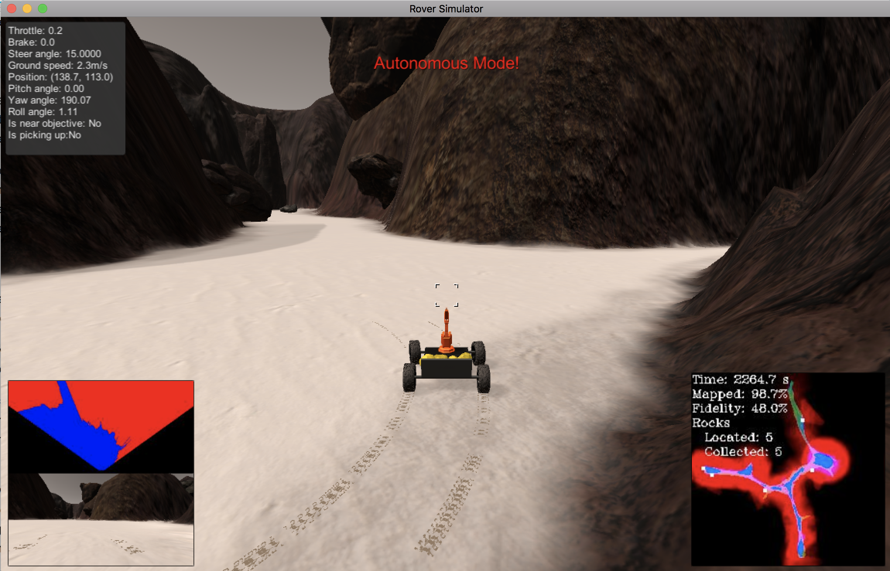

# Notebook Analysis

Run the functions provided in the notebook on test images (first with the test data provided, next on data you have recorded). Add/modify functions to allow for color selection of obstacles and rock samples.

Describe in your writeup (and identify where in your code) how you modified or added functions to add obstacle and rock sample identification.
___
For obstacle detection, I used the `color_thresh` function to identify ground pixels that are navigable. This function takes in the image and applies an rgb threshold (here >160, >160, >160 since the ground is light) to identify navigable ground terrain that isn't obstacles. The obstacles are then just the bitwise not version of the navigable terrain found via thresholding with an additional mask that limits it to the camera field of view.

For rock sample identification, I added a `find_rocks` function that takes in the image and applies a similar rgb color threshold for the yellow rocks. The rocks are bright in red and green and dark in blue so a threshold of >110, >110, <50 works.

___
Populate the `process_image()` function with the appropriate analysis steps to map pixels identifying navigable terrain, obstacles and rock samples into a worldmap. Run `process_image()` on your test data using the moviepy functions provided to create video output of your result.

Describe in your writeup how you modified the `process_image()` to demonstrate your analysis and how you created a worldmap. Include your video output with your submission.
___
To start updating `process_image()`, I did a perspective transform that warps the rover's camera images to an overhead view. This is done via a calibration image with grid lines drawn on. Using the corner points corresponding to a square grid from the source / calibration image I can convert images coming in from the rover camera to be in the overhead view. In `perspect_transform()` also created a mask that corresponds to the navigable terrain in the camera field of view.

I then identified navigable terrain by using the `color_thresh` function discussed above. I then found the obstacles by using the navigable terrain and inverting it and then limiting it to the camera field of view via a mask.

Next, I converted the threshold image to rover-centric coordinates and converted the rover coordinates to world coordinates. 

I also updated the world map to show the navigable and obstacle. The worldmap is initialized as being all black. The navigable terrain is colored in as blue. The obstacles are colored in as red. If there is overlap between navigable and obstacle, it is considered navigable.

Finally, rocks are found via the `find_rocks` function, converted to rover then world coordinates, and are added to the map as white pixels.

# Autonomous Navigation and Mapping

Fill in the `perception_step()` (at the bottom of the perception.py script) and `decision_step()` (in decision.py) functions in the autonomous mapping scripts and an explanation is provided in the writeup of how and why these functions were modified as they were.

`perception_step()` and `decision_step()` functions have been filled in and their functionality explained in the writeup.
___

I did much of the same things I did in the notebook. I updated the `perspect_transform()` function with a mask and added a `find_rocks()` function. For `perception_step()` I took much of the same code from `process_image()` except I used fields from the RoverState class. 

Again, I did a perspective transform that warps the rover's camera images to an overhead view. I thresholded to find navigable terrain and obstacles. I converted to these thresholded values to rover coordinates and world coordinates. Using these, I updated the world map to show the navigable terrain and obstacles. I took navigable terrain values and found the angles and distance to each point and saved that in the Rover state as `Rover.nav_angles` so it could navigate using the angles. 

I found rocks using the find_rocks function and found the closest rock pixel as well since the rock pixels get sprayed out after perspective transform. I stored the rock angles as `rock_angles` and distances as `rock_dists` in the Rover state and also updated the world map with the rock location.

Now with `Rover.nav_angles` and `Rover.rock_angles` populated, in `decision.py`, I made two general updates to the code. One was to help collect rocks and another was to help when the rover got stuck. 

To collect rocks, I checked if there were `rock_angles` in the Rover state and then steered the rover toward the rock. If there were rock angles and `rover.near_sample` was true, I made the rover brake. If there were rock angles but `rover.near_sample` was false, I made the rover slow down by either braking and/or reducing throttle. Once the rover was near the sample and stopped, it sent a signal to pick up.

To help with the rover getting stuck, I created a mode called `stuck`. This would be set whenever the rover was in `forward` mode but its velocity was slightly above zero (so it's not in `stop` mode but would still basically be moving a very tiny amount unable to go anywhere meaningful). When the mode was set to `stuck`, the rover would steer -15 degrees to help find a new direction to proceed in.
___
Launching in autonomous mode your rover can navigate and map autonomously. Explain your results and how you might improve them in your writeup.

Make a note of your simulator settings (resolution and graphics quality set on launch) and frames per second (FPS output to terminal by drive_rover.py) in your writeup when you submit the project so your reviewer can reproduce your results.
___

My simulator was set to 1152x720 a 36fps. 

After about 5 minutes, I was successfully able to map 72.5% with 68.6% fidelity and collect 4 rocks. 

After about 30-35 minutes, I was able to map 98.7% with 48.0% fidelity and collect 5 rocks.

I would improve my results by making sure my rover doesn't map the same area again and again. There is a portion of the map where the rover would often drive in the same circle again and again because there would be more navigable terrain on one side than another so the rover wouldn't explore the other side. Because the rover doesn't actually remember where it's been (e.g. by referencing the world map), it will often retread territory it has already seen. 

I would also try to return the rocks to the starting point.

To accomplish both these improvements, I would try to implement true destination navigation so that a rover could revisit an area it's seen before. Specifically, I could store some sort of graph of `obs_x_world` and `obs_y_world` rather than just update the world map with color. I could then try to traverse the graph to find the shortest path to return to a starting point. I could also look for areas in the graph where there wasn't an obstacle beyond a point yet the rover hadn't been there yet (this would help find new unmapped areas faster).